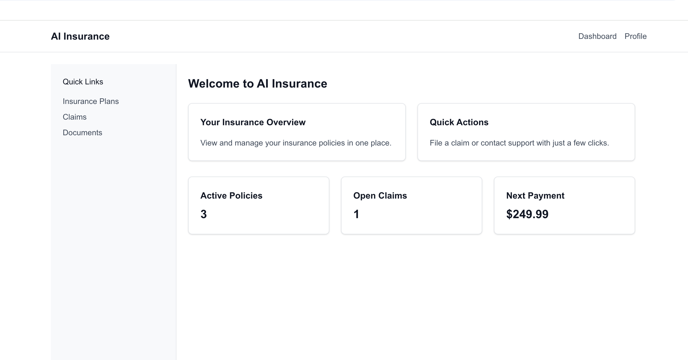
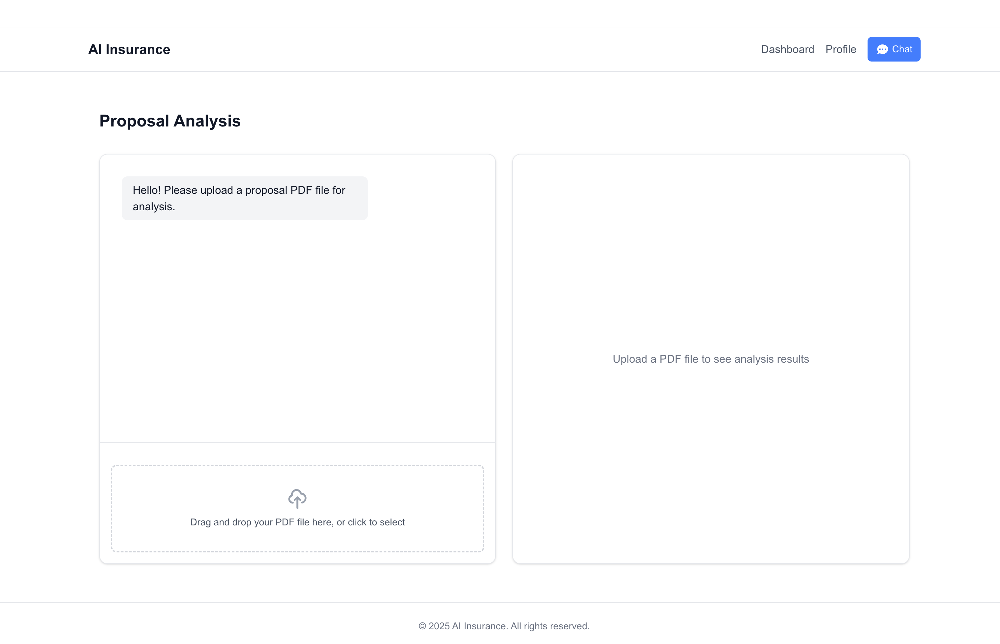
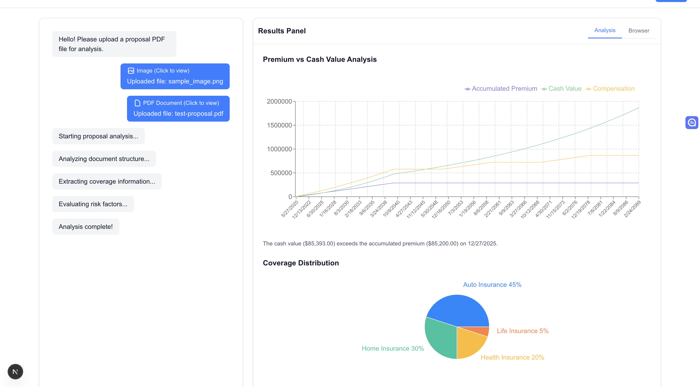

# AI Insurance Demo

A modern insurance platform powered by AI, built with Next.js, React, and Tailwind CSS. This demo showcases a user-friendly interface for managing insurance policies, claims, and documents with a focus on accessibility and responsive design.

## Preview





The application features a modern, responsive interface with dark mode support, intuitive navigation, and a comprehensive dashboard for managing insurance policies and claims.

## Features

- **Modern UI/UX**: Clean and responsive design with dark mode support
- **Dashboard Overview**: Quick access to insurance policies, claims, and payments
- **Policy Management**: View and manage insurance policies in one place
- **Claims Processing**: Streamlined claims filing and tracking
- **Document Management**: Easy access to insurance-related documents
- **AI-Powered PDF Analysis**: Intelligent analysis of insurance documents and proposals
- **Real-time Chat Interface**: Interactive communication with AI assistant
- **Multi-step Purchase Flow**: Guided insurance plan selection and verification process

## Tech Stack

- **Framework**: [Next.js 14](https://nextjs.org) with App Router
- **Language**: [TypeScript](https://www.typescriptlang.org)
- **Styling**: [Tailwind CSS](https://tailwindcss.com)
- **State Management**: [Zustand](https://zustand-demo.pmnd.rs/) for efficient state handling
- **Real-time Updates**: Server-Sent Events (SSE) for live communication
- **Font**: [Geist](https://vercel.com/font) by Vercel
- **Linting**: ESLint with Next.js and Prettier configurations

## Getting Started

### Prerequisites

- Node.js 18.17 or later
- npm, yarn, or pnpm package manager

### Installation

1. Clone the repository
2. Install dependencies:

   ```bash
   npm install
   # or
   yarn install
   # or
   pnpm install
   ```

### Development

Run the development server:

```bash
npm run dev
# or
yarn dev
# or
pnpm dev
```

Open [http://localhost:3000](http://localhost:3000) with your browser to see the result.

### Build

Create a production build:

```bash
npm run build
# or
yarn build
# or
pnpm build
```

## Project Structure

```
src/
  ├── app/           # App router pages and layouts
  │   ├── api/      # API routes and endpoints
  │   ├── chat/     # AI chat interface
  │   ├── claims/   # Claims management
  │   └── purchase/ # Multi-step purchase flow
  ├── components/    # Reusable UI components
  │   ├── chat/     # Chat interface components
  │   ├── layout/   # Layout components
  │   └── purchase/ # Purchase flow components
  └── lib/          # Utility functions and shared logic
      ├── models/   # Data models and types
      ├── services/ # Business logic and services
      └── store/    # State management
```

## Development Guidelines

- Follow the existing code style and conventions
- Use TypeScript for type safety
- Maintain responsive design principles
- Write clean, maintainable code with proper documentation
- Follow ESLint and Prettier configurations

## Learn More

To learn more about the technologies used in this project:

- [Next.js Documentation](https://nextjs.org/docs) - Next.js features and API
- [Tailwind CSS Documentation](https://tailwindcss.com/docs) - Utility-first CSS framework
- [TypeScript Documentation](https://www.typescriptlang.org/docs) - TypeScript language reference

## Contributing

Contributions are welcome! Please feel free to submit a Pull Request.

## License

This project is licensed under the MIT License - see the LICENSE file for details.
